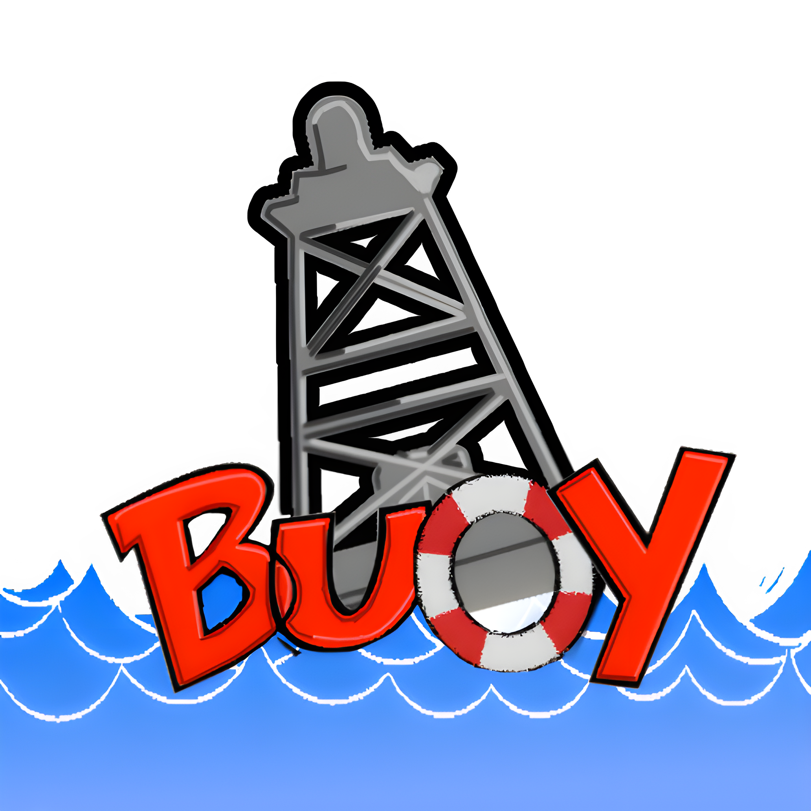

# Buoy  

**Buoy** is a **mod manager** designed for **WEBFISHING** using **GDWeave**!

## Features

- 🎯 **Easy mod installation and management**  
- 🔄 **Automatic updates** for mods and the GDWeave mod loader  
- 🛠️ **User-friendly interface** for enabling/disabling mods  
- ⚙️ **Mod configuration editing**  
- 📦 **Import custom mods** from ZIP files
- 🔍 **Search functionality** for available and installed mods  
- 📝 **Detailed mod information display**  
- ⚡ **One-click setup** for game directory and required components  
- 🚫 **NO MORE USER TRACKING!!**  

## Using Buoy

Download the [latest release ZIP](https://github.com/draconiandeveloper/Buoy/releases/tag/v1.0.2) for your system *(be it Windows or Linux)*, extract the .zip contents to anywhere you like, then run the `Buoy_v1.0.2` executable file.

Simple as that! You'll only need to go through a one-time setup process.

⚠️ **Do NOT download the source code** unless you know what you’re doing. 

## Using GDWeave on Linux
Follow the guide **[here](guides/LINUX.md)**

## Building Buoy

1. Open the project's root directory *(the one that contains this Markdown file)*.

2. Run: `python -m venv venv`.

3. Access the virtual Python environment: `source venv/bin/activate`.

    - If you're using FISH as your shell, then `source venv/bin/activate.fish`.

    - If you're using CSH as your shell, then `source venv/bin/activate.csh`.

4. Install requirements: `pip install -r requirements.txt`

5. Build: `python compile.py`

## **Troubleshooting / Tips**  

- ❗ If you encounter any issues, try running the program as **administrator**.  
- ⚙️ You may need to install **[.NET 8](https://dotnet.microsoft.com/en-us/download/dotnet/8.0)** manually. While the installer attempts to automate this, it's not perfect.
- ⚙️ If the game runs without mods when you chose the modded run option, run WEBFISHING through Steam first and then go back to HLS:R and relaunch through there. (This is an uncommon issue)
